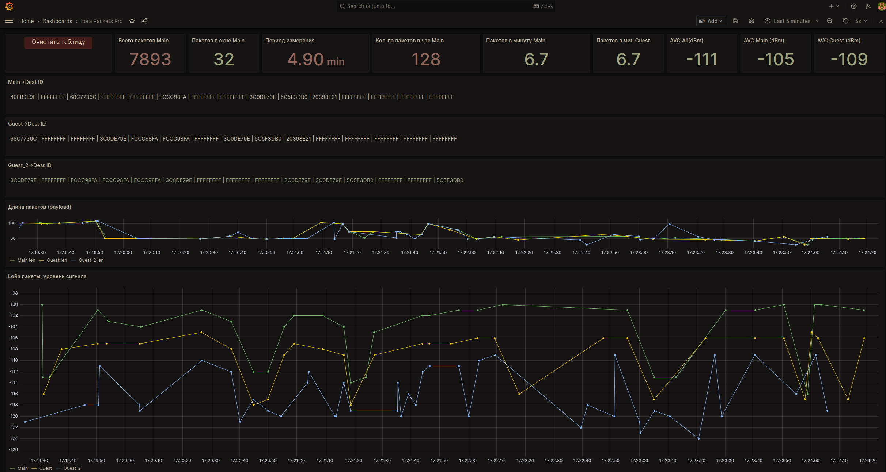
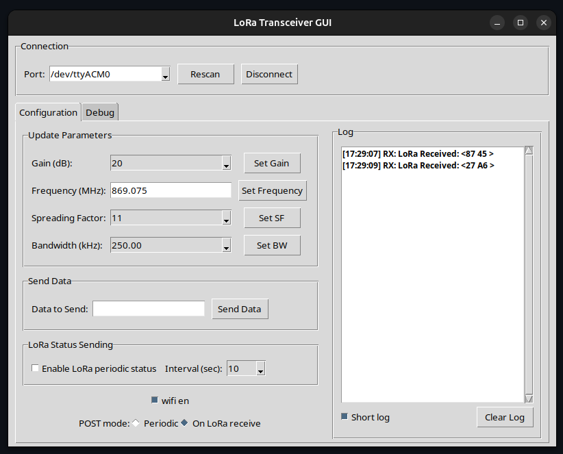
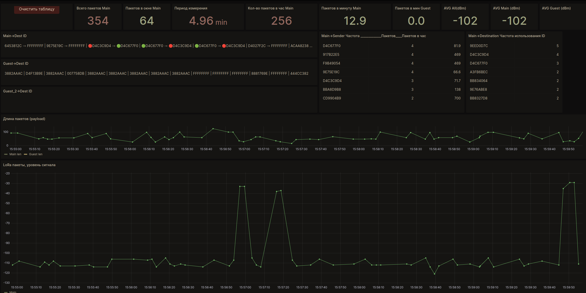
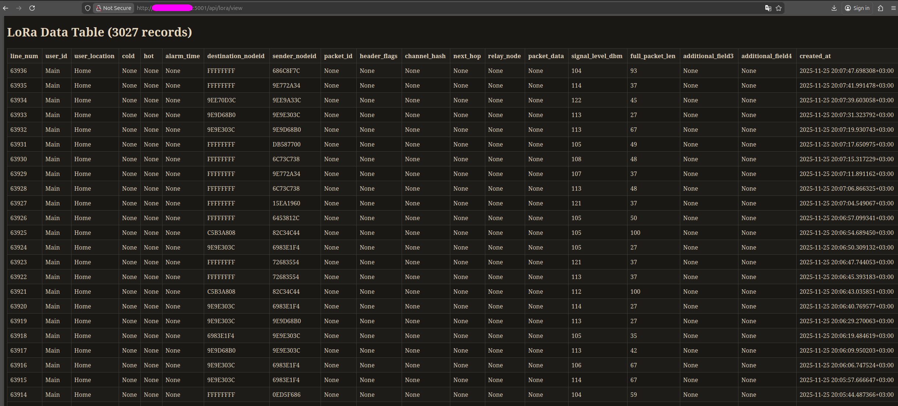
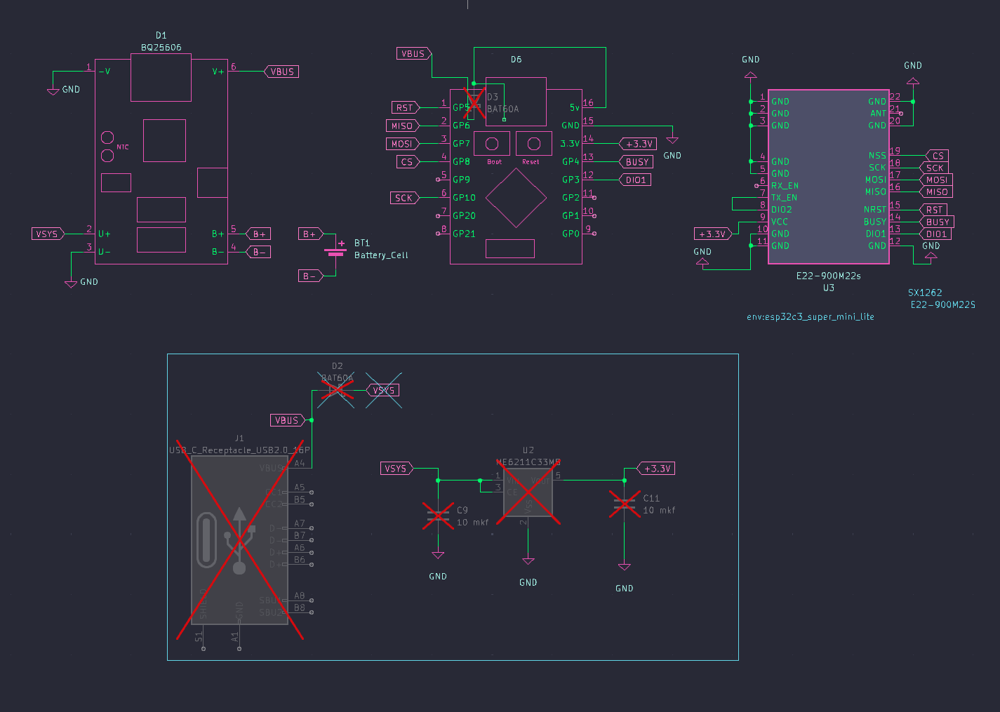

# Mini LoRa Transceiver

Проект для тестирования нагрузки  LoRa сети на базе ESP32-C3 Supermini и радиомодема E22-900M22S (SX1262).

Монитор загрузки сети без MQTT.
Три приемных LoRa модуля с разными антеннами, слушают Long Fast,
при обнаружении пакетов, отправляют на сервер
- уровень сигнала,
- длину пакета,
- заголовок пакета (ID ноды назначения и отправителя).

Ноды могут находиться в любой локации, необходимо обеспечить подключение к интернету через WiFi.
Онлайн визуальная статистика доступна с любого устройства через браузер и Grafana дашборды.
Количество нод ограничено количеством одновременных запросов к серверной базе данных (100).


## Описание






*Организация бесперебойного питания на базе Bq25606*

Этот проект реализует LoRa трансивер для беспроводной связи на базе ESP32-C3 и модуля SX1262. Поддерживает передачу и прием данных через Serial интерфейс, управление через команды, сохранение данных во flash память.

Проект основан на [mini_lora_transceiver](https://github.com/lukuky64/mini_lora_transceiver/) с добавлением графического интерфейса для управления.

## Серверная часть

Серверная часть проекта включает REST API на базе Flask для обработки данных LoRa сети. API принимает данные от нод ESP32, сохраняет их в базе данных PostgreSQL и предоставляет интерфейс для просмотра и анализа статистики.

- **API сервер**: Принимает POST запросы с данными о пакетах LoRa (уровень сигнала, ID ноды, длина пакета и т.д.)
- **База данных**: PostgreSQL с таблицей для хранения пакетов и метаданных, поддерживает одновременные подключения (до 100 по умолчанию)
- **Веб-интерфейс**: HTML представление данных для просмотра в браузере
- **Визуализация**: Интеграция с Grafana для создания дашбордов и графиков статистики сети
- **Эндпоинты**: Получение данных, добавление новых записей, очистка таблицы, проверка здоровья

Подробная информацию и инструкции по настройке находятся в папке [server_backend/](server_backend/).

## Структура проекта

```
LoRa-Traffic-Tester/
├── README.md                    # Этот файл
├── firmware/                    # Firmware для ESP32
│   ├── platformio.ini           # Конфигурация PlatformIO
│   ├── config.json              # Конфигурационный файл ESP32
│   ├── requirements.txt         # Зависимости Python
│   ├── build_script.py          # Скрипт сборки ESP32
│   ├── upload_script.py          # Скрипт загрузки на ESP32
│   ├── clean_script.py          # Скрипт очистки
│   ├── .gitignore               # Игнорируемые файлы Git
│   ├── src/
│   │   └── main.cpp             # Основной файл ESP32
│   ├── lib/
│   │   ├── lora_config.hpp      # Конфигурация LoRa и GPIO
│   │   ├── commander/           # Модуль команд
│   │   │   ├── commander.hpp
│   │   │   └── commander.cpp
│   │   ├── control/             # Основной контроллер
│   │   │   ├── control.hpp
│   │   │   └── control.cpp
│   │   ├── LoRaCom/             # LoRa коммуникации
│   │   │   ├── LoRaCom.hpp
│   │   │   └── LoRaCom.cpp
│   │   ├── SerialCom/           # Serial коммуникации
│   │   │   ├── SerialCom.hpp
│   │   │   └── SerialCom.cpp
│   │   ├── fileSystem/          # Работа с flash памятью
│   │   │   ├── saveFlash.hpp
│   │   │   └── saveFlash.cpp
│   │   ├── wifi_manager/        # WiFi управление
│   │   │   ├── wifi_manager.hpp
│   │   │   └── wifi_manager.cpp
│   │   └── fake_network_definitions.h # Заглушка сетевых определений
│   ├── bin/                     # Скомпилированные бинарники ESP32
│   ├── mesh_src/                # Исходники для mesh функционала
│   ├── Test_WiFi/               # Тестовая конфигурация с WiFi
│   │   ├── src/
│   │   ├── lib/
│   │   ├── bin/
│   │   ├── platformio.ini
│   │   ├── README.md
│   │   ├── requirements.txt
│   │   └── scripts/
│   ├── upload_mesh/             # Инструменты для загрузки mesh
│   │   ├── README.md
│   │   ├── requirements.txt
│   │   ├── flash.py
│   │   └── mesh_bin/
│   └── LoRa-Traffic-Tester.code-workspace # Настройки рабочего пространства VS Code
├── gui/                         # Графический интерфейс для управления
│   ├── gui.py                   # GUI для управления проектом
│   └── gui_config.json          # Конфигурация GUI
├── server_backend/              # Серверная часть проекта
│   └── lora_flask_api/
│       ├── lora_api.py          # REST API сервер на Flask
│       ├── config.py            # Конфигурация базы данных PostgreSQL
│       ├── How_to_create_DB_Postgress.md # Инструкция по настройке БД
│       └── Grafana/
│           ├── README.md
│           └── Grafana__dashboard_pro_v1.json
├── kicad/                       # KiCad PCB design files
│   ├── README.md
│   ├── .gitignore
│   ├── Info/                    # Documentation and datasheets
│   │   ├── E22_900M22s_info/
│   │   │   ├── E22-900M22s_info.c
│   │   │   ├── E22-900M22S_UserManual_EN_v1.3.pdf
│   │   │   └── E22-900M22s_pics/
│   │   ├── Esp32c3_supermini_info/
│   │   └── Signal_analyze/
│   └── Kicad_LoRa_v3_esp32c3_module_bq25606/  # Main PCB project
│       ├── ESP32C3-E22-Mesh-Node_v3.kicad_pcb
│       ├── ESP32C3-E22-Mesh-Node_v3.kicad_sch
│       ├── ESP32C3-E22-Mesh-Node_v3.kicad_pro
│       ├── ESP32C3-E22-Mesh-Node_v3.kicad_prl
│       ├── fp-info-cache
│       ├── fp-lib-table
│       ├── sym-lib-table
│       ├── footprints/
│       │   ├── Lora_Library.pretty/
│       │   └── VIP_metr_Library.pretty/
│       ├── symbols/
│       │   ├── Lora_lib.kicad_sym
│       │   └── VIP_metr_lib.kicad_sym
│       └── pics/
└── pics/                        # Изображения и скриншоты проекта
```

## Конфигурация GPIO

GPIO пины определены в `lib/lora_config.hpp`:

### Текущая конфигурация:
- **BUTTON_PIN**: GPIO9 (BOOT button)
- **LORA_RESET**: GPIO5 (RST от SX1262)
- **LORA_DIO1**: GPIO3 (DIO1 от SX1262)
- **LORA_RXEN**: GPIO2 (RX enable)
- **LORA_BUSY**: GPIO4 (BUSY от SX1262)
- **LORA_SCK**: GPIO10 (SPI clock)
- **LORA_MISO**: GPIO6 (SPI MISO)
- **LORA_MOSI**: GPIO7 (SPI MOSI)
- **LORA_CS**: GPIO8 (SPI CS)
- **INDICATOR_LED1**: GPIO2 (LED индикатор)

## Установка и настройка

### Требования
- Python 3.8+
- PlatformIO CLI
- Виртуальное окружение Python (venv)

### Настройка
1. Клонируйте репозиторий
2. Создайте виртуальное окружение в текущей папке: `python3 -m venv venv`
3. Активируйте виртуальное окружение: `source venv/bin/activate`
4. Установите зависимости: `pip install -r requirements.txt`
5. Настройте GPIO пины в `lib/lora_config.hpp` (если необходимо)
6. Настройте пути в `config.json` под вашу систему

### Конфигурационный файл config.json
```json
{
  "_guide": "Этот файл содержит конфигурацию для Python скриптов сборки/загрузки. Используется только venv_activate для автоматической активации виртуального окружения.",
  "venv_activate": "venv/bin/activate"
}
```

## Сборка и загрузка

### Сборка
```bash
python3 build_script.py
```
Собирает проект и копирует бинарные файлы в папку `bin/`.

### Загрузка
```bash
# Только загрузка существующего бинарника
python3 upload_script.py

# Сборка + загрузка
python3 upload_script.py --build
```

### Очистка
```bash
python3 clean_script.py
```
Удаляет папки `.pio`, `bin`.

## Использование

### Serial команды
Подключитесь к ESP32 через Serial (115200 baud) и используйте команды:

- `help` - список команд
- `command update gain <value>` - установить усиление
- `command update freqMhz <value>` - установить частоту
- `command update sf <value>` - установить spreading factor
- `command update bwKHz <value>` - установить bandwidth
- `command set status <0|1>` - включить/выключить автоматическую отправку статуса
- `data <payload>` - отправить данные
- `flash` - прочитать сохраненные данные из flash

### GUI
Запустите графический интерфейс:
```bash
python3 gui.py
```

## Особенности

- Автоматическая активация venv среды
- Сохранение данных во flash память
- Поддержка команд через Serial
- LED индикация состояния
- Настраиваемые параметры LoRa

## Разработка

Проект использует:
- **ESP32-C3** микроконтроллер
- **SX1262** LoRa модуль
- **RadioLib** библиотека для LoRa
- **PlatformIO** для сборки
- **ESP-IDF** framework
