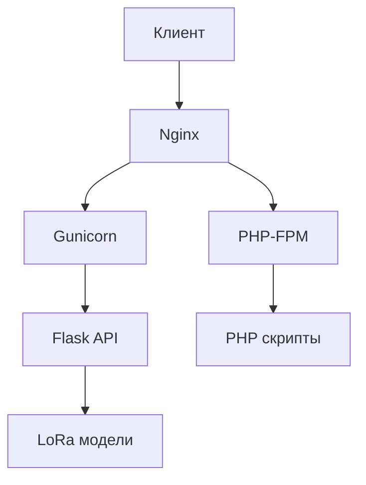

# Миграция с Apache на Nginx для LoRa Traffic Tester

## Задача

Перенести веб-сервер с Apache на Nginx, сохранив работоспособность всех существующих PHP-скриптов и добавив поддержку нового Flask API для работы с LoRa-моделями.

## Исходное состояние

- **Сервер:** Ubuntu Linux
- **Веб-сервер:** Apache2 (порт 80)
- **PHP:** версия 8.1.2
- **Путь к PHP скриптам:** `/var/www/html/`
- **Домен:** bauman-robotics.ru-central1.internal

## Целевое состояние

- **Веб-сервер:** Nginx (порт 80) + PHP-FPM
- **Flask API:** Gunicorn (порт 5001) за reverse proxy Nginx
- **Сохранение всех существующих PHP-скриптов**
- **Единая точка входа через Nginx**

## Структура взаимодействия

```
Клиент (HTTP запросы)
    |
    v
Nginx (порт 80)
    |
    +--> PHP-FPM (обработка PHP скриптов)
    |
    +--> Reverse Proxy --> Gunicorn (порт 5001) --> Flask API (lora_api.py)
```

### Диаграмма взаимодействия компонентов



## Конфигурационные файлы

- `nginx.conf` - основная конфигурация Nginx
- `lora-api_php-apps_unified` - конфигурация сайта Nginx
- `lora-api.service` - systemd служба для запуска Flask API

## Настройка Nginx

1. Отредактируйте файл конфигурации сайта:
   ```
   sudo nano /etc/nginx/sites-available/lora-api_php-apps_unified
   ```

2. Включите сайт:
   ```
   sudo ln -s /etc/nginx/sites-available/lora-api_php-apps_unified /etc/nginx/sites-enabled/
   ```

3. Проверьте активные сайты:
   ```
   ls -la /etc/nginx/sites-enabled/
   ```

4. Для отключения сайта:
   ```
   sudo rm /etc/nginx/sites-enabled/my-site
   ```

### Настройка безопасности и оптимизации

Отредактируйте основную конфигурацию Nginx:
```
sudo nano /etc/nginx/nginx.conf
```

## Настройка службы systemd для Flask API

1. Создайте файл службы:
   ```
   sudo nano /etc/systemd/system/lora-api.service
   ```

2. Перезагрузите systemd:
   ```
   sudo systemctl daemon-reload
   ```

3. Запустите службу:
   ```
   sudo systemctl start lora-api
   ```

4. Включите автозагрузку:
   ```
   sudo systemctl enable lora-api
   ```

5. Проверьте статус:
   ```
   sudo systemctl status lora-api
